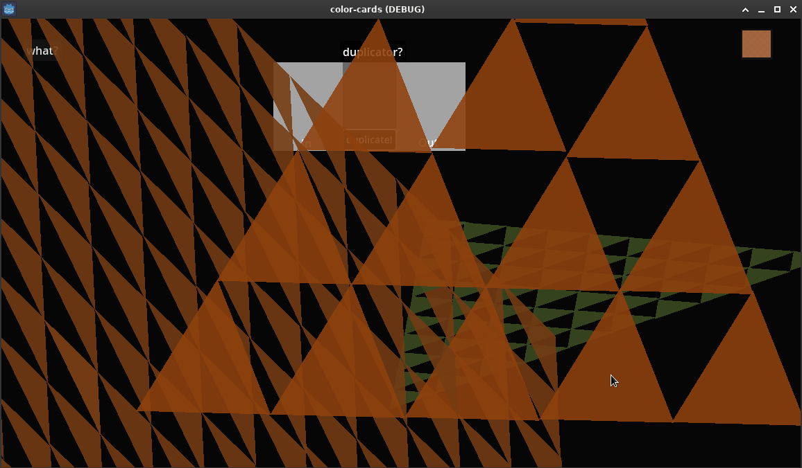
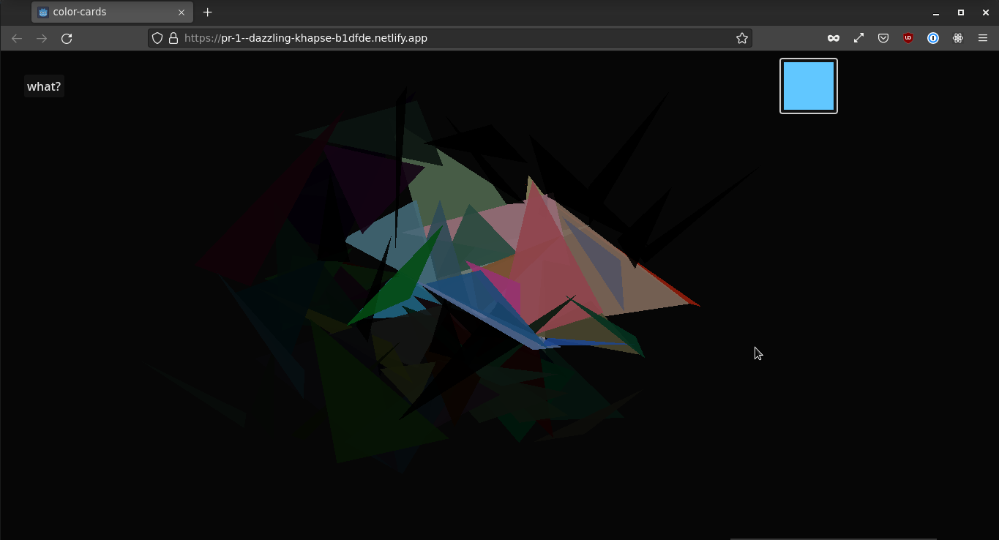
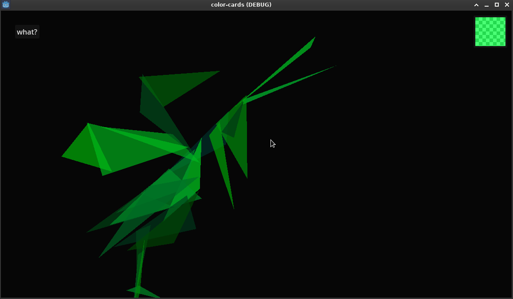
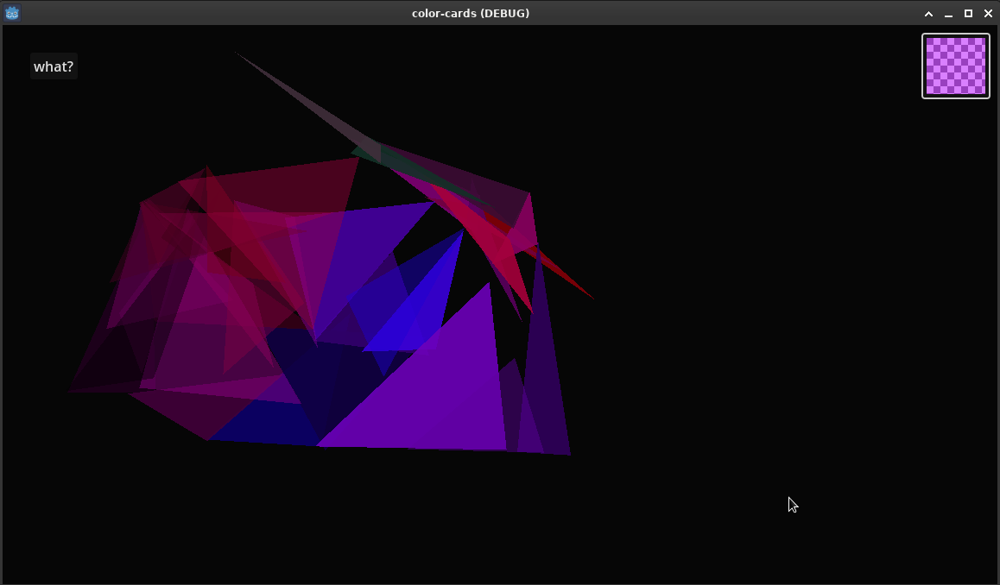

# Triangles

A little app about triangles, made in Godot.

Try it: https://pr-4--dazzling-khapse-b1dfde.netlify.app

Currently, Godot web builds do not work on Mac OS or iOS.

Go to the Releases section to download builds for Mac, Linux and Windows.

## Example Images:

## Duplicator!

Version 0.4.0 adds a triangle Duplicator! If you find a triangle that you like, you can place it on the "In." side and duplicate it. You can duplicate many triangles at once.

## Controls:

Q Creates a Triangle.

R Clears All Triangles.

Left Click drags Triangles.

Right Click deletes Triangles.

Color picker to the upper right.

E Saves a Screenshot.

S to Save, L to Load.
